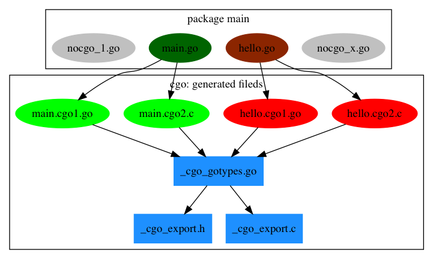

# 2.2. CGO编程基础

Go是一门以实用为主要目的的编程语言，我们可以通过cgo来直接调用C语言代码，也可以在C语言代码中直接调用Go函数。要使用CGO特性，需要安装C／C++构建工具链，在macOS和Linux下是要安装和GCC，在windows下是需要安装MinGW工具。同时需要保证环境变量`CGO_ENABLED`被设置为1，这表示CGO是被启用的状态。在本地构建时`CGO_ENABLED`默认是启用的，当交叉构建时CGO默认是禁止的。比如要交叉构建ARM环境运行的Go程序，需要手工设置好C/C++交叉构建的工具链，同时开启`CGO_ENABLED`环境变量。

## `import "C"`语句

如果在Go代码中出现了`import "C"`语句则表示使用了CGO特性，紧跟在这行语句前面的注释是一种特殊语法，里面包含的是正常的C语言代码。当确保CGO启用的情况下，还可以在当前目录中包含C/C++对应的源文件。

举个最简单的例子：

```Go
package main

/*
#include <stdio.h>

void printint(int v) {
    printf("printint: %d\n", v);
}
*/
import "C"
import "unsafe"

func main() {
    v := 42
    C.printint(C.int(v))
}
```

这个例子展示了cgo的基本使用方法。开头的注释中写了要调用的C函数和相关的头文件，头文件被include之后里面的所有的C语言元素都会被加入到”C”这个虚拟的包中。需要注意的是，import "C"导入语句需要单独一行，不能与其他包一同import。向C函数传递参数也很简单，就直接转化成对应C语言类型传递就可以。如上例中`C.int(v)`用于将一个Go中的int类型值强制类型转换转化为C语言中的int类型值，然后调用C语言定义的printint函数进行打印。

需要注意的是，Go是强类型语言，所以cgo中传递的参数类型必须与声明的类型完全一致，而且传递前必须用”C”中的转化函数转换成对应的C类型，不能直接传入Go中类型的变量。同时通过虚拟的C包导入的C语言符号并不需要是大写字母开头，它们不受Go语言的导出规则约束。

cgo将当前包引用的C语言符号都放到了虚拟的C包中，同时当前包依赖的其它Go语言包内部可能也通过cgo引入了相似的虚拟C包，但是不同的Go语言包引入的虚拟的C包之间的类型是不能通用的。这个约束对于要自己构造一些cgo辅助函数时有可能会造成一点的影响。

比如我们希望在Go中定义一个C语言字符指针对应的CChar类型，然后增加一个GoString方法返回Go语言字符串：

```go
package cgo_helper

import "C"

type CChar C.char

func (p *CChar) GoString() string {
    return C.GoString((*C.char)(p))
}

func PrintCString(cs *C.char) {
    print(cs.GoString())
}
```

现在我们可能会想在其它的Go语言包中也使用这个辅助函数：

```go
package main

// static char* cs = "hello"
import "C"
import "./cgo_helper"

func main() {
    cgo_helper.PrintCString(C.cs)
}
```

这段代码是不能正常工作的，因为当前main包引入的`C.cs`变量的类型是当前main包的cgo构造的虚拟的C包下的char类型，它和cgo_helper包引入的`*C.char`类型是不同的。在Go语言中方法是依附于类型存在的，不同Go包中引入的虚拟的C包的类型却是不同的，这导致从它们延伸出来的Go类型也是不同的类型，这最终导致了前面代码不能正常工作。

有Go语言使用经验的用户可能会建议参数转型后再传入。但是这个方法似乎也是不可行的，因为`cgo_helper.PrintCString`的参数是它自身包引入的`*C.char`类型，在外部是无法直接获取这个类型的。换言之，一个包如果在公开的接口中直接使用了`*C.char`等类似的虚拟C包的类型，其它的Go包是无法直接使用这些类型的，除非这个Go包同时也提供了`*C.char`类型的构造函数。因为这些诸多因素，如果想在go test环境直接测试这些cgo导出的类型也会于通用的限制。

<!-- 测试代码；需要确实是否有问题 -->

## `#cgo`语句

在`import "C"`语句前的注释中可以通过`#cgo`语句设置编译阶段和链接阶段的相关参数。编译阶段的参数主要用于定义相关宏和指定头文件检索路径。链接阶段的参数主要是指定库文件检索路径和要链接的库文件。

```go
// #cgo CFLAGS: -DPNG_DEBUG=1 -I./include
// #cgo LDFLAGS: -L/usr/local/lib -lpng
// #include <png.h>
import "C"
```

上面的代码中，CFLAGS部分，`-D`部分定义了宏PNG_DEBUG，值为1；`-I`定义了头文件包含的检索目录。LDFLAGS部分，`-L`指定了链接时库文件检索目录，`-l`指定了链接时需要链接png库。


因为C/C++遗留的问题，C头文件检索目录可以是相对目录，但是库文件检索目录则需要绝对路径。在库文件的检索目录中可以通过`${SRCDIR}`变量表示当前包目录的绝对路径：

```
// #cgo LDFLAGS: -L${SRCDIR}/libs -lfoo
```

上面的代码在链接时将被展开为：

```
// #cgo LDFLAGS: -L/go/src/foo/libs -lfoo
```

`#cgo`语句主要影响CFLAGS、CPPFLAGS、CXXFLAGS、FFLAGS和LDFLAGS几个编译器环境变量。LDFLAGS用于设置链接时的参数，除此之外的几个变量用于改变编译阶段的构建参数(CFLAGS用于针对C语言代码设置编译参数)。

对于在cgo环境混合使用C和C++的用户来说，可能有三种不同的编译选项：其中CFLAGS对应C语言特有的编译选项、CXXFLAGS对应是C++特有的编译选项、CPPFLAGS则对应C和C++共有的编译选项。但是在链接阶段，C和C++的链接选项是通用的，因此这个时候已经不再有C和C++语言的区别，它们的目标文件的类型是相同的。

`#cgo`指令还支持条件选择，当满足某个操作系统或某个CPU架构类型时后面的编译或链接选项生效。比如下面是分别针对windows和非windows下平台的编译和链接选项：

```
// #cgo windows CFLAGS: -DX86=1
// #cgo !windows LDFLAGS: -lm
```

其中在windows平台下，编译前会预定义X86宏为1；再非widnows平台下，在链接阶段会要求链接math数学库。这种用法对于在不同平台下只有少数编译选项差异的场景比较适用。

如果在不同的系统下cgo对应着不同的c代码，我们可以先使用`#cgo`指令定义不同的C语言的宏，然后通过宏来区分不同的代码：

```go
package main

/*
#cgo windows CFLAGS: -DCGO_OS_WINDOWS=1
#cgo darwin CFLAGS: -DCGO_OS_DARWIN=1
#cgo linux CFLAGS: -DCGO_OS_LINUX=1

#if defined(CGO_OS_WINDOWS)
	static char* os = "windows";
#elif defined(CGO_OS_DARWIN)
	static char* os = "darwin";
#elif defined(CGO_OS_LINUX)
	static char* os = "linux";
#else
#	error(unknown os)
#endif
*/
import "C"

func main() {
	print(C.GoString(C.os))
}
```

这样我们就可以用C语言中常用的技术来处理不同平台之间的差异代码。

## build tag 条件编译

build tag 是在Go或cgo环境下的C/C++文件开头的一种特殊的注释。条件编译类似于前面通过`#cgo`指令针对不同平台定义的宏，只有在对应平台的宏被定义之后才会构建对应的代码。但是通过`#cgo`指令定义宏有个限制，它只能是基于Go语言支持的windows、darwin和linux等已经支持的操作系统。如果我们希望定义一个DEBUG标志的宏，`#cgo`指令就无能为力了。而Go语言提供的build tag 条件编译特性则可以简单做到。

比如下面的源文件只有在设置debug构建标志时才会被构建：

```go
// +build debug

package main

var buildMode = "debug"
```

可以用以下命令构建：

```
go build -tags="debug"
go build -tags="windows,debug"
```

我们可以通过`-tags`命令行参数同时指定多个build标志，它们之间用逗号分割。

当有多个build tag时，我们将多个标志通过逻辑操作的规则来组合使用。比如以下的构建标志表示只有在linux/386或非cgo环境的darwin平台下才进行构建。

```go
// +build linux,386 darwin,!cgo
```

其中`linux,386`中linux和386用逗号链接表示AND的意思；而`linux,386`和`darwin,!cgo`之间通过空白分割来表示OR的意思。

## CGO生成的中间文件

要了解CGO技术的底层秘密首先需要了解CGO生成了哪些中间文件。我们可以在构建一个cgo包时增加一个`-work`输出中间生成文件所在的目录并且在构建完成时保留中间文件。如果是比较简单的cgo代码我们也可以直接通过手工调用`go tool cgo`命令来查看生成的中间文件。

在一个Go源文件中，如果出现了`import "C"`指令则表示将调用cgo命令生成对应的中间文件。下图是cgo生成的中间文件的简单示意图：



包中有4个Go文件，其中nocgo开头的文件中没有`import "C"`指令，其它的2个文件则包含了cgo代码。cgo命令会为每个包含了cgo代码的Go文件创建2个中间文件，比如 main.go 会分别创建 main.cgo1.go 和 main.cgo2.c 两个中间文件。然后会为整个包创建一个 `_cgo_gotypes.go` Go文件，其中包含Go语言部分辅助代码。此外还会创建一个 `_cgo_export.h` 和 `_cgo_export.c` 文件，对应Go语言导出到C语言的类型和函数。
