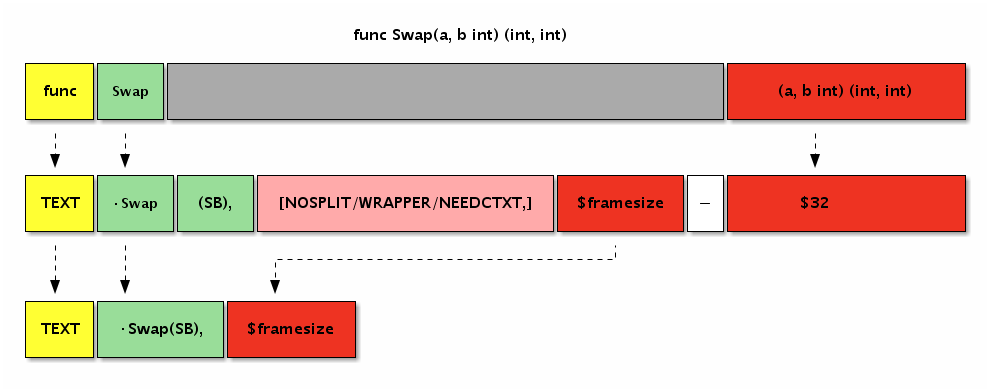
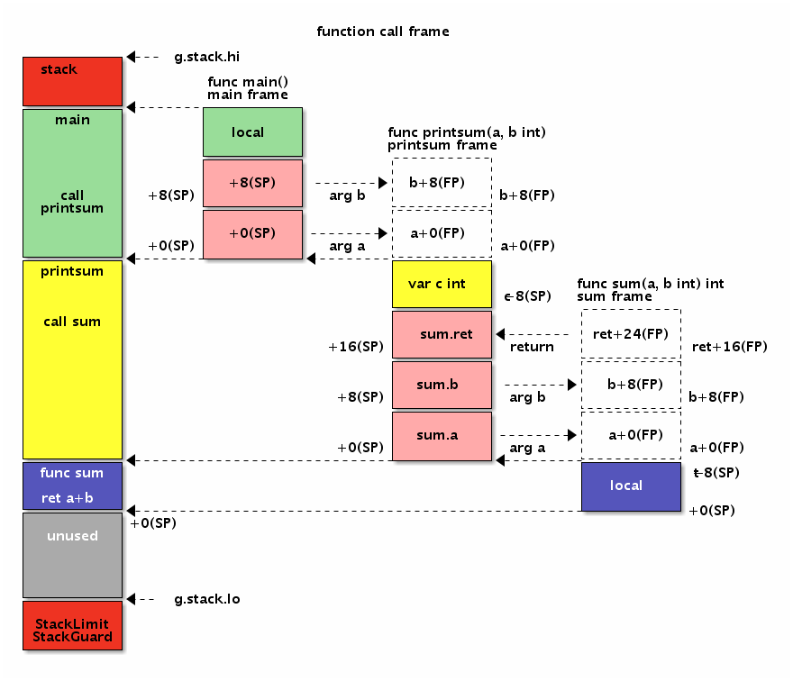

# 3.4. 函数

终于到函数了！因为Go汇编语言中，可以也建议通过Go语言来定义全局变量，那么剩下的也就是函数了。只有掌握了汇编函数的基本用法，才能真正算是Go汇编语言入门。本章将简单讨论Go汇编中函数的定义和用法。

## 基本语法

函数标识符通过TEXT汇编指令定义，表示该行开始的指令定义在TEXT内存段。TEXT语句后的指令一般对应函数的实现，但是对于TEXT指令本身来说并不关心后面是否有指令。我个人觉得TEXT和LABEL定义的符号是类似的，区别只是LABEL是用于跳转标号，但是本质上他们都是通过标识符映射一个内存地址。




函数的定义的语法如下：

```
TEXT symbol(SB), [flags,] $framesize[-argsize]
```

函数的定义部分由5个部分组成：TEXT指令、函数名、可选的flags标志、函数帧大小和可选的函数参数大小。

其中TEXT用于定义函数符号，函数名中当前包的路径可以省略。函数的名字后面是`(SB)`，表示是函数名符号相对于SB伪寄存器的偏移量，二者组合在一起最终是绝对地址。作为全局的标识符的全局变量和全局函数的名字一般都是基于SB伪寄存器的相对地址。标志部分用于指示函数的一些特殊行为，常见的NOSPLIT主要用于指示叶子函数不进行栈分裂。framesize部分表示函数的局部变量需要多少栈空间，其中包含调用其它函数时准备调用参数的隐式栈空间。最后是可以省略的参数大小，之所以可以省略是因为编译器可以从Go语言的函数声明中推导出函数参数的大小。

下面是在main包中Add在汇编中两种定义方式：

```
// func Add(a, b int) int
TEXT main·Add(SB), NOSPLIT, $0-24

// func Add(a, b int) int
TEXT ·Add(SB), $0
```

第一种是最完整的写法：函数名部分包含了当前包的路径，同时指明了函数的参数大小为24个字节（对应参数和返回值的3个int类型）。第二种写法则比较简洁，省略了当前包的路径和参数的大小。需要注意的是，标志参数中的NOSPLIT如果在Go语言函数声明中通过注释指明了标志，应该也是可以省略的（需要确认下）。

目前可能遇到的函数标志有NOSPLIT、WRAPPER和NEEDCTXT几个。其中NOSPLIT不会生成或包含栈分裂代码，这一般用于没有任何其它函数调用的叶子函数，这样可以适当提高性能。WRAPPER标志则表示这个是一个包装函数，在panic或runtime.caller等某些处理函数帧的地方不会增加函数帧计数。最后的NEEDCTXT表示需要一个上下文参数，一般用于闭包函数。

需要注意的是函数也没有类型，上面定义的Add函数签名可以下面任意一种格式：

```
func Add(a, b int) int
func Add(a, b, c int)
func Add() (a, b, c int)
func Add() (a []int) // reflect.SliceHeader 切片头刚好也是 3 个 int 成员
// ...
```

对于汇编函数来说，只要是函数的名字和参数大小一致就可以是相同的函数了。而且在Go汇编语言中，输入参数和返回值参数是没有任何的区别的。

## 函数参数和返回值

对于函数来说，最重要的是函数对外提供的API约定，包含函数的名称、参数和返回值。当这些都确定之后，如何精确计算参数和返回值的大小是第一个需要解决的问题。


比如有一个Foo函数的签名如下：

```go
func Foo(a, b int) (c int)
```

对于这个函数，我们可以轻易看出它需要3个int类型的空间，参数和返回值的大小也就是24个字节：

```
TEXT ·Foo(SB), $0-24
```

那么如何在汇编中引用这3个参数呢？为此Go汇编中引入了一个FP伪寄存器，表示函数当前帧的地址，也就是第一个参数的地址。因此我们以通过`+0(FP)`、`+8(FP)`和`+16(FP)`来分别引用a、b、c三个参数。

但是在汇编代码中，我们并不能直接使用`+0(FP)`来使用参数。为了编写易于维护的汇编代码，Go汇编语言要求，任何通过FP寄存器访问的变量必和一个临时标识符前缀组合后才能有效，一般使用参数对应的变量名作为前缀。

下面的代码演示了如何在汇编函数中使用参数和返回值：

```
TEXT ·Foo(SB), $0
	MOVEQ a+0(FP), AX  // a
	MOVEQ b+8(FP), BX  // b
	MOVEQ c+16(FP), CX // c
	RET
```

如果是参数和返回值类型比较复杂的情况该如何处理呢？下面我们再尝试一个更复杂的函数参数和返回值的计算。比如有以下一个函数：

```go
func SomeFunc(a, b int, c bool) (d float64, err error)
```

函数的参数有不同的类型，同时含有多个返回值，而且返回值中含有更复杂的接口类型。我们该如何计算每个参数的位置和总的大小呢？

其实函数参数和返回值的大小以及对齐问题和结构体的大小和成员对齐问题是一致的。我们先看看如何用Go语言函数来模拟Foo函数中参数和返回值的地址：

```go
func Foo(FP *struct{a, b, c int}) {
	_ = unsafe.Offsetof(FP.a) + uintptr(FP) // a
	_ = unsafe.Offsetof(FP.b) + uintptr(FP) // b
	_ = unsafe.Offsetof(FP.c) + uintptr(FP) // c

	_ = unsafe.Sizeof(*FP) // argsize

	return
}
```

我们尝试将全部的参数和返回值以同样的顺序放到一个结构体中，将FP伪寄存器作为唯一的一个指针参数，而每个成员的地址也就是对应原来参数的地址。

用同样的策略可以很容易计算前面的SomeFunc函数的参数和返回值的地址和总大小。

因为SomeFunc函数的参数比较多，我们临时定一个`SomeFunc_args_and_returns`结构体用于对应参数和返回值：

```go
type SomeFunc_args_and_returns struct {
	a int
	b int
	c bool
	d float64
	e error
}
```

然后将SomeFunc原来的参数替换为结构体形式，并且只保留唯一的FP作为参数：

```go
func SomeFunc(FP *SomeFunc_args_and_returns) {
	_ = unsafe.Offsetof(FP.a) + uintptr(FP) // a
	_ = unsafe.Offsetof(FP.b) + uintptr(FP) // b
	_ = unsafe.Offsetof(FP.c) + uintptr(FP) // c
	_ = unsafe.Offsetof(FP.d) + uintptr(FP) // d
	_ = unsafe.Offsetof(FP.e) + uintptr(FP) // e

	_ = unsafe.Sizeof(*FP) // argsize

	return
}
```

代码完全和Foo函数参数的方式类似。唯一的差异是每个函数的偏移量，这有`unsafe.Offsetof`函数自动计算生成。因为Go结构体中的每个成员已经满足了对齐要求，因此采用通用方式得到每个参数的偏移量也是满足对齐要求的。


<!-- TODO: 内容 -->

## 函数中的局部变量

从Go语言函数角度讲，局部变量是函数内明确定义的变量，同时也包含函数的参数和返回值变量。但是从Go汇编角度看，局部变量是指函数运行时，在当前函数栈帧所对应的内存内的变量，不包含函数的参数和返回值（因为访问方式有差异）。函数栈帧的空间主要由函数参数和返回值、局部变量和被调用其它函数的参数和返回值空间组成。为了便于理解，我们可以将汇编函数的局部变量类比为Go语言函数中显式定义的变量，不包含参数和返回值部分。


为了便于访问局部变量，Go汇编语言引入了伪SP寄存器，对应当前栈帧的底部。因为在当前栈帧时栈的底部是固定不变的，因此局部变量的相对于伪SP的偏移量也就是固定的，这可以简化局部变量的维护工作。SP真伪区分只有一个原则：如果使用SP时有一个临时标识符前缀就是伪SP，否则就是真SP寄存器。比如`a(SP)`和`b+8(SP)`有a和b临时前缀，这里都是伪SP，而前缀部分一般用于表示局部变量的名字。而`(SP)`和`+8(SP)`没有临时标识符作为前缀，它们都是真SP寄存器。

在X86平台，函数的调用栈是从高地址向低地址增长的，因此伪SP寄存器对应栈帧的底部其实是对应更大的地址。当前栈的顶部对应真实存在的SP寄存器，对应当前函数栈帧的栈顶，对应更小的地址。如果整个内容是用Memory数组表示，那么`Memory[0(SP):end-0(SP)]`就是对应当前栈帧的切片，其中开始位置是真SP，结尾部分是伪SP。真SP一般用于表示调用其它函数时的参数和返回值，真SP对应内存较低的地址，所以被访问变量的偏移量是正数；而伪SP对应高地址，对应的局部变量的偏移量都是负数。

我们现在Go语言定义一个Foo函数，并在函数内部定义几个局部变量：

```go
func Foo() { var a, b, c int }
```

然后通过汇编语言重新实现Foo函数，并通过伪SP来定位局部变量：

```
TEXT ·Foo(SB), $24-0
	MOVQ a-8*3(SP), AX // a
	MOVQ b-8*2(SP), BX // b
	MOVQ c-8*1(SP), CX // c
	RET
```

Foo函数有3个int类型的局部变量，但是没有调用其它的函数，所以函数的栈帧大小为24个字节。因为Foo函数没有参数和返回值，因此参数和返回值大小为0个字节，当然这个部分可以省略不写。而局部变量中先定义的变量a离为SP对应的地址最远，最后定义的变量c里伪SP最近。有两个原因导致出现这种逆序的结果：一个从Go语言函数角度理解，先定义的a变量地址要比后定义的变量的地址更小；另一个是伪SP对应栈帧的底部，而栈是从高向地生长的，所以有着更小地址的a变量离栈的底部伪SP更远。

我们同样可以通过结构体来模拟局部变量的布局：

```go
func Foo() {
	var local [1]struct{a, b, c int};
	var SP = &local[1];

	_ = -(unsafe.Sizeof(local)-unsafe.Offsetof(local.a)) + uintptr(&SP) // a
	_ = -(unsafe.Sizeof(local)-unsafe.Offsetof(local.b)) + uintptr(&SP) // b
	_ = -(unsafe.Sizeof(local)-unsafe.Offsetof(local.c)) + uintptr(&SP) // c
}
```

我们将之前的三个局部变量挪到一个结构体中。然后构造一个SP变量对应伪SP寄存器，对应局部变量结构体的顶部。然后根据局部变量总大小和每个变量对应成员的偏移量计算相对于伪SP的距离，最终偏移量是一个负数。

通过这种方式可以处理复制的局部变量的偏移，同时也能包装每个变量地址的对齐要求。当然，除了地址对齐外，局部变量的布局并没有顺序要求。对于汇编比较熟悉同学可以根据字节的习惯组织变量的布局。


## 调用其它函数

常见的用Go汇编实现的函数都是叶子函数，也就是被其它函数调用，但是很少调用其它函数。这主要是因为叶子函数比较简单，可以简化汇编函数的编写；同时一般性能或特性的瓶颈也处于叶子函数。但是能够调用其它函数和能够被其它函数调用同样重要，否则Go汇编就不是一个完整的汇编语言。

在前文中我们已经学习过一些汇编实现的函数参数和返回值处理的规则。那么一个显然的问题是，汇编函数的参数是从哪里来的？答案同样明显，被调用函数的参数是有调用方准备的：调用方在栈上设置好空间和数据后调用函数，被调用方在返回前将返回值放在对应的位置，函数通过RET指令返回调用方函数之后，调用方从返回值对应的栈内存位置取出结果。Go语言函数的调用参数和返回值均是通过栈传输的，这样做的优点是函数调用栈比较清晰，缺点是函数调用有一定的性能损耗（Go编译器是通过函数内联来缓解这个问题的影响）。



为了便于演示，我们先用Go语言构造foo和bar两个函数，其中foo函数内部调用bar函数：

```go
func foo() {
	var a, b int
	bar(b)
}

func bar(a int) int {
	return a
}
```

然后用汇编重新实现类似的函数：

```
TEXT ·foo(SB), $32-0
	MOVQ a-8*2(SP), AX // a
	MOVQ b-8*1(SP), BX // b

	MOVQ BX, +0(SP)    // bar(BX)
	CALL ·bar(SB)      //
	MOVQ +8(SP), CX    // CX = bar(a)
	RET

TEXT ·bar(SB), $0-16
	MOVQ a-0(FP), AX   // a

	MOVQ AX, ret+8(FP) // return a
	RET
```

首先分析foo函数的栈帧的大小：foo函数内部有a、b两个局部变量占用16个字节，然后要需给要调用的bar函数准备的参数和返回值准备16字节的空间，因此总共有32字节的栈帧大小。在调用bar函数前我们已经计算好了栈帧的大小，Go汇编语言环境已将真实的SP寄存器调整到合适的大小，在调用函数时并不需要再手动调整SP寄存器。在调用函数bar前，真SP对应向下增长的栈顶部，因此顶部的16个字节和bar函数的参数和返回值是对应的相同的内存空间。我们将保存了b的BX寄存器内容放入`+0(SP)`位置，也就是准备bar函数的第一个参数。然后通过CALL指令进行函数调用。在bar函数内，首先从第一个参数对应的`+0(FP)`位置去取参数值存入AX寄存器，然后再将AX内容放入返回值对应的`ret+8(FP)`内存位置，最后调用RET返回。在foo函数中，调用bar函数返回后，从bar函数返回值对应的`+8(SP)`位置取出结果放到CX寄存，从而完成函数调用。

调用其它函数前调用方要选择保存相关寄存器到栈中，并在调用函数返回后选择要恢复的寄存器进行保存。Go语言中函数调用是一个复杂的问题，因为Go函数不仅仅要了解函数调用函数的布局，还会涉及到栈的跳转，栈上局部变量的生命周期管理。本节只是简单了解函数调用参数的布局规则，在后续的章节中会更详细的讨论函数的细节。

## 宏函数

宏函数并不是Go汇编语言所定义，而是Go汇编引入的预处理特性自带的特性。

在C语言中我们可以通过带参数的宏定义一个交换2个数的宏函数：

```c
#define SWAP(x, y) do{ int t = x; x = y; y = t; }while(0)
```

我们可以用类似的方式定义一个交换两个寄存器的宏：

```c
#define SWAP(x, y, t) MOVQ x, t; MOVQ y, x; MOVQ t, y
```

因为汇编语言中无法定义临时变量，我们增加一个参数用于临时寄存器。下面是通过SWAP宏函数交换AX和BX寄存器的值，然后返回结果：

```
// func Swap(a, b int) (int, int)
TEXT ·Swap(SB), $0-32
	MOVQ a-8*2(SP), AX // a
	MOVQ b-8*1(SP), BX // b

	SWAP(AX, BX, CX)     // AX, BX = b, a

	MOVQ AX, ret0+16(FP) // return
	MOVQ BX, ret1+24(FP) //
	RET
```

因为预处理器可以通过条件编译针对不同的平台定义宏的实现，这样可以简化平台带来的差异。

