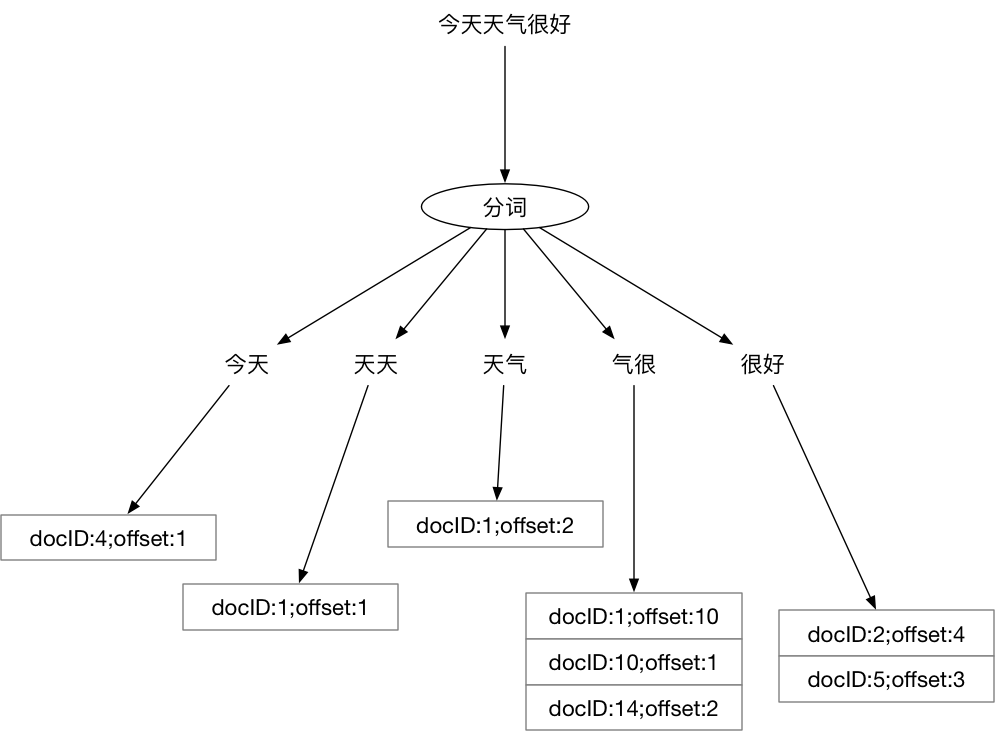
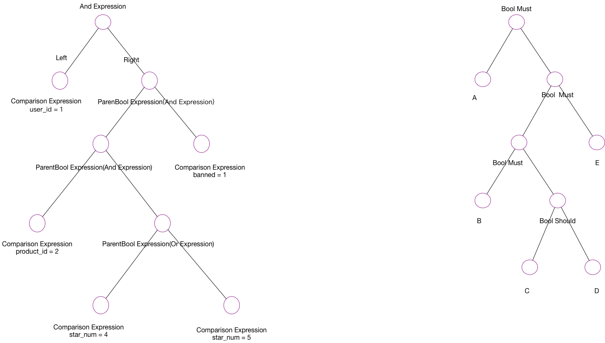

# 6.2. 分布式搜索引擎

在 web 一章中，我们提到 MySQL 很脆弱。数据库系统本身要保证实时和强一致性，所以其功能设计上都是为了满足这种一致性需求。比如 write ahead log 的设计，基于 B+ 树实现的索引和数据组织，以及基于 MVCC 实现的事务等等。

关系型数据库一般被用于实现 OLTP 系统，所谓 OLTP，援引 wikipedia:

> 在线交易处理（OLTP, Online transaction processing）是指透过信息系统、电脑网络及数据库，以线上交易的方式处理一般即时性的作业数据，和更早期传统数据库系统大量批量的作业方式并不相同。OLTP通常被运用于自动化的数据处理工作，如订单输入、金融业务…等反复性的日常性交易活动。和其相对的是属于决策分析层次的联机分析处理（OLAP）。

在互联网的业务场景中，也有一些实时性要求不高(可以接受多 s 的延迟)，但是查询复杂性却很高的场景。举个例子，在电商的 wms 系统中，或者在大多数业务场景丰富的 crm 或者客服系统中，可能需要提供几十个字段的随意组合查询功能。这种系统的数据维度天生众多，比如一个电商的 wms 中对一件货物的描述，可能有下面这些字段：

> 仓库 id，入库时间，库位分区 id，储存货架 id，入库操作员 id，出库操作员 id，库存数量，过期时间，sku 类型，产品品牌，产品分类，内件数量

除了上述信息，如果商品在仓库内有流转。可能还有有关联的流程 id，当前的流转状态等等。

想像一下，如果我们所经营的是一个大型电商，每天有千万级别的订单，那么在这个数据库中查询和建立合适的索引都是一件非常难的事情。

在 CRM 或客服类系统中，常常有根据关键字进行搜索的需求，大型互联网公司每天会接收数以万计的用户投诉。而考虑到事件溯源，用户的投诉至少要存 2~3 年。又是千万级甚至上亿的数据。根据关键字进行一次 like 查询，可能整个 MySQL 就直接挂掉了。

这时候我们就需要搜索引擎来救场了。

## 搜索引擎

elasticsearch 是开源分布式搜索引擎的霸主，其依赖于 Lucene 实现，在部署和运维方面做了很多优化。当今搭建一个分布式搜索引擎比起 Sphinx 的时代已经是容易很多很多了。只要简单配置客户端 ip 和端口就可以了。

### 倒排列表

虽然 es 是针对搜索场景来订制的，但如前文所言，实际应用中常常用 es 来作为 database 来使用，就是因为倒排列表的特性。可以用比较朴素的观点来理解倒排索引：

```
┌─────────────────┐       ┌─────────────┬─────────────┬─────────────┬─────────────┐                                          
│  order_id: 103  │──────▶│ doc_id:4231 │ doc_id:4333 │ doc_id:5123 │ doc_id:9999 │                                          
└─────────────────┘       └─────────────┴─────────────┴─────────────┴─────────────┘                                          
                                                                                                                             
                                                                                                                             
                                                                                                                             
                                                                                                                             
                                                                                                                             
┌─────────────────┐       ┌─────────────┬─────────────┬─────────────┬─────────────┬─────────────┐                            
│  sku_id: 30221  │──────▶│ doc_id:4231 │ doc_id:5123 │ doc_id:5644 │ doc_id:7801 │ doc_id:9999 │                            
└─────────────────┘       └─────────────┴─────────────┴─────────────┴─────────────┴─────────────┘                            
                                                                                                                             
                                                                                                                             
                                                                                                                             
                                                                                                                             
┌─────────────────┐       ┌─────────────┬─────────────┬─────────────┬─────────────┬─────────────┬─────────────┬─────────────┐
│   city_id: 3    │──────▶│ doc_id:5123 │ doc_id:9999 │doc_id:10232 │doc_id:54321 │doc_id:63142 │doc_id:71230 │doc_id:90123 │
└─────────────────┘       └─────────────┴─────────────┴─────────────┴─────────────┴─────────────┴─────────────┴─────────────┘
```

对 es 中的数据进行查询时，本质就是求多个排好序的序列求交集。非数值类型字段涉及到分词问题，大多数内部使用场景下，我们可以直接使用默认的 bi-gram 分词。什么是 bi-gram 分词呢：

即将所有 Ti 和 T(i+1) 组成一个词(在 es 中叫 term)，然后再编排其倒排列表，这样我们的倒排列表大概就是这样的：



当用户搜索 '天气很好' 时，其实就是求：天气、气很、很好三组倒排列表的交集，但这里的相等判断逻辑有些特殊，用伪代码表示一下：

```go
func equal() {
    if postEntry.docID of '天气' == postEntry.docID of '气很' && postEntry.offset + 1 of '天气' == postEntry.offset of '气很' {
        return true
    }

    if postEntry.docID of '气很' == postEntry.docID of '很好' && postEntry.offset + 1 of '气很' == postEntry.offset of '很好' {
        return true
    }

    if postEntry.docID of '天气' == postEntry.docID of '很好' && postEntry.offset + 2 of '天气' == postEntry.offset of '很好' {
        return true
    }

    return false
}
```

多个有序列表求交集的时间复杂度是：O(N * M)， N 为给定列表当中元素数最小的集合， M 为给定列表的个数。

在整个算法中起决定作用的一是最短的倒排列表的长度，其次是词数总和，一般词数不会很大(想像一下，你会在搜索引擎里输入几百字来搜索么？)，所以起决定性作用的，一般是所有倒排列表中，最短的那一个的长度。

因此，文档总数很多的情况下，搜索词的倒排列表最短的那一个不长时，搜索速度也是很快的。如果用关系型数据库，那就需要按照索引(如果有的话)来慢慢扫描了。

### 查询 DSL

es 定义了一套查询 DSL，当我们把 es 当数据库使用时，需要用到其 bool 查询。举个例子：

```json
{
  "query": {
    "bool": {
      "must": [
        {
          "match": {
            "field_1": {
              "query": "1",
              "type": "phrase"
            }
          }
        },
        {
          "match": {
            "field_2": {
              "query": "2",
              "type": "phrase"
            }
          }
        },
        {
          "match": {
            "field_3": {
              "query": "3",
              "type": "phrase"
            }
          }
        },
        {
          "match": {
            "field_4": {
              "query": "4",
              "type": "phrase"
            }
          }
        }
      ]
    }
  },
  "from": 0,
  "size": 1
}
```

看起来比较麻烦，但表达的意思很简单：

```go
if field_1 == 1 && field_2 == 2 && field_3 == 3 && field_4 == 4 {
    return true
}
```

用 bool should query 可以表示 or 的逻辑：

```json
{
  "query": {
    "bool": {
      "should": [
        {
          "match": {
            "field_1": {
              "query": "1",
              "type": "phrase"
            }
          }
        },
        {
          "match": {
            "field_2": {
              "query": "3",
              "type": "phrase"
            }
          }
        }
      ]
    }
  },
  "from": 0,
  "size": 1
}
```

这里表示的是类似：

```go
if field_1 == 1 || field_2 == 2 {
    return true
}
```

这些 Go 代码里 if 后面跟着的表达式在编程语言中有专有名词来表达 Boolean Expression：

```go
4 > 1
5 == 2
3 < i && x > 10
```

es 的 Bool Query 方案，实际上就是用 json 来表达了这种程序语言中的 Boolean Expression，为什么可以这么做呢？因为 json 本身是可以表达树形结构的，我们的程序代码在被编译器 parse 之后，也会变成 AST，而 AST 抽象语法树，顾名思义，就是树形结构。理论上 json 能够完备地表达一段程序代码被 parse 之后的结果。这里的 Boolean Expression 被编译器 Parse 之后也会生成差不多的树形结构，而且只是整个编译器实现的一个很小的子集。

### 基于 client sdk 做开发

TODO

### 将 sql 转换为 DSL

比如我们有一段 bool 表达式，user_id = 1 and (product_id = 1 and (star_num = 4 or star_num = 5) and banned = 1)，写成 SQL 是如下形式：

```sql
select * from xxx where user_id = 1 and (product_id = 1 and (star_num = 4 or star_num = 5) and banned = 1)
```

写成 es 的 DSL 是如下形式：

```json
{
  "query": {
    "bool": {
      "must": [
        {
          "match": {
            "user_id": {
              "query": "1",
              "type": "phrase"
            }
          }
        },
        {
          "match": {
            "product_id": {
              "query": "1",
              "type": "phrase"
            }
          }
        },
        {
          "bool": {
            "should": [
              {
                "match": {
                  "star_num": {
                    "query": "4",
                    "type": "phrase"
                  }
                }
              },
              {
                "match": {
                  "star_num": {
                    "query": "5",
                    "type": "phrase"
                  }
                }
              }
            ]
          }
        },
        {
          "match": {
            "banned": {
              "query": "1",
              "type": "phrase"
            }
          }
        }
      ]
    }
  },
  "from": 0,
  "size": 1
}
```

es 的 DSL 虽然很好理解，但是手写起来非常费劲。前面提供了基于 SDK 的方式来写，但也不足够灵活。

SQL 的 where 部分就是 boolean expression。我们之前提到过，这种 bool 表达式在被 parse 之后，和 es 的 DSL 的结构长得差不多，我们能不能直接通过这种“差不多”的猜测来直接帮我们把 SQL 转换成 DSL 呢？

当然可以，我们把 SQL 的 where 被 Parse 之后的结构和 es 的 DSL 的结构做个对比：




既然结构上完全一致，逻辑上我们就可以相互转换。我们以广度优先对 AST 树进行遍历，然后将二元表达式转换成 json 字符串，再拼装起来就可以了，限于篇幅，本文中就不给出示例了，读者朋友可以查看：

> github.com/cch123/elasticsql

来学习具体的实现。

## 异构数据同步

在实际应用中，我们很少直接向搜索引擎中写入数据。更为常见的方式是，将 MySQL 或其它关系型数据中的数据同步到搜索引擎中。而搜索引擎的使用方只能对数据进行查询，无法进行修改和删除。

常见的同步方案有两种：

### 通过时间戳进行增量数据同步

```
  ┌────────────────────────┐     ┌────────────────────────┐                                    
  │ move 10 min data to es │     │ move 10 min data to es │                                    
  └────────────────────────┘     └────────────────────────┘                                    
                                                                                               
               │                               │                              ┌───────────────┐
───────────────┼────────────────┬──────────────┴─────────────┬──────────────▶ │  time passes  │
               │   ┌───────┐    │                            │                └───────────────┘
               │◀──┤ 10min ├───▶│                  ┌────────────────────────┐                  
               │   └───────┘    │                  │ move 10 min data to es │                  
                                │                  └────────────────────────┘                  
                                │                                                              
                                │                                                              
                                │                                                              
                                │                                                              
                    ┌────────────────────────┐                                                 
                    │ move 10 min data to es │                                                 
                    └────────────────────────┘                                                 
```

这种同步方式与业务强绑定，例如 wms 系统中的出库单，我们并不需要非常实时，稍微有延迟也可以接受，那么我们可以每分钟从 MySQL 的出库单表中，把最近十分钟创建的所有出库单取出，批量存入 es 中，具体的逻辑实际上就是一条 SQL：

```sql
select * from wms_orders where update_time >= date_sub(now(), interval 10 minute);
```

当然，考虑到边界情况，我们可以让这个时间段的数据与前一次的有一些重叠：

```sql
select * from wms_orders where update_time >= date_sub(now(), interval 11 minute);
```

取最近 11 分钟有变动的数据覆盖更新到 es 中。这种方案的缺点显而易见，我们必须要求业务数据严格遵守一定的规范。比如这里的，必须要有 update_time 字段，并且每次创建和更新都要保证该字段有正确的时间值。否则我们的同步逻辑就会丢失数据。

### 通过 binlog 进行数据同步

```
                ┌────────────────────────┐                                         
                │      MySQL master      │                                         
                └────────────────────────┘                                         
                             │                                                     
                             │                                                     
                             │                                                     
                             │                                                     
                             │                                                     
                             │                                                     
                             ▼                                                     
                   ┌───────────────────┐                                           
                   │ row format binlog │                                           
                   └───────────────────┘                                           
                             │                                                     
                             │                                                     
                             │                                                     
             ┌───────────────┴──────────────┐                                      
             │                              │                                      
             │                              │                                      
             ▼                              ▼                                      
┌────────────────────────┐         ┌─────────────────┐                             
│      MySQL slave       │         │      canal      │                             
└────────────────────────┘         └─────────────────┘                             
                                            │                                      
                                  ┌─────────┴──────────┐                           
                                  │   parsed binlog    │                           
                                  └─────────┬──────────┘                           
                                            │                                      
                                            ▼                                      
                                   ┌────────────────┐                              
                                   │     kafka      │─────┐                        
                                   └────────────────┘     │                        
                                                          │                        
                                                          │                        
                                                          │                        
                                                          │                        
                                              ┌───────────┴──────┐                 
                                              │  kafka consumer  │                 
                                              └───────────┬──────┘                 
                                                          │                        
                                                          │                        
                                                          │                        
                                                          │      ┌────────────────┐
                                                          └─────▶│ elasticsearch  │
                                                                 └────────────────┘
```

业界使用较多的是阿里开源的 canal，来进行 binlog 解析与同步。canal 会伪装成 MySQL 的从库，然后解析好行格式的 binlog，再以更容易解析的格式(例如 json) 发送到消息队列。

由下游的 kafka 消费者负责把上游数据表的自增主键作为 es 的 document 的 id 进行写入，这样可以保证每次接收到 binlog 时，对应 id 的数据都被覆盖更新为最新。MySQL 的 row 格式的 binlog 会将每条记录的所有字段都提供给下游，所以实际上在向异构数据目标同步数据时，不需要考虑数据是插入还是更新，只要一律按 id 进行覆盖即可。

这种模式同样需要业务遵守一条数据表规范，即表中必须有唯一主键 id 来保证我们进入 es 的数据不会发生重复。一旦不遵守该规范，那么就会在同步时导致数据重复。当然，你也可以为每一张需要的表去订制消费者的逻辑，这就不是通用系统讨论的范畴了。
