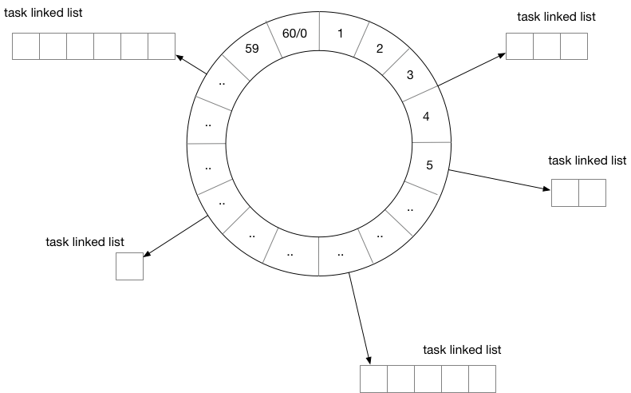

# 6.10. 延时任务系统

我们在做系统时，很多时候是处理实时的任务，请求来了马上就处理，然后立刻给用户以反馈。但有时也会遇到非实时的任务，比如确定的时间点发布重要公告。或者需要在用户做了一件事情的 X 分钟/Y 小时后，对其特殊动作，比如通知、发券等等。

如果业务规模比较小，有时我们也可以通过 db + 轮询来对这种任务进行简单处理，但上了规模的公司，自然会寻找更为普适的解决方案来解决这一类问题。

一般有两种思路来解决这个问题：

1. 实现一套类似 crontab 的分布式定时任务管理系统
2. 实现一个支持定时发送消息的消息队列。

两种思路进而衍生出了一些不同的系统，但其本质是差不多的。都是需要实现一个定时器。定时器英文为 timer，在单机的场景下其实并不少见，例如我们在和网络库打交道的时候经常会写 `SetReadDeadline`，这实际上就是在本地创建了一个定时器，在到达指定的时间后，我们会收到定时器的通知，告诉我们时间已到。这时候如果读取还没有完成的话，就可以认为发生了网络问题，从而中断读取。

timer 的实现在工业界已经是有解的问题了。常见的就是时间堆和时间轮。

## timer 实现

### 时间堆

最常见的时间堆一般用小顶堆实现，小顶堆其实就是一种特殊的二叉树：

```
                        ┌─────┐                         
                        │     │                         
                        │  5  │                         
                        └─────┘                         
                           │                            
                           │                            
                ┌──────────┴──────────┐                 
                │                     │                 
                ▼                     ▼                 
             ┌─────┐               ┌─────┐              
             │     │               │     │              
             │  6  │               │  10 │              
             └─────┘               └─────┘              
                │                     │                 
           ┌────┴─────┐          ┌────┴─────┐           
           │          │          │          │           
           ▼          ▼          ▼          ▼           
        ┌─────┐    ┌─────┐    ┌─────┐    ┌─────┐        
        │     │    │     │    │     │    │     │        
        │  7  │    │  6  │    │  11 │    │  20 │        
        └─────┘    └─────┘    └─────┘    └─────┘        
           │                                │           
           │                                │           
   ┌───────┴────┐                           └───────┐   
   │            │                                   │   
   ▼            ▼                                   ▼   
┌─────┐      ┌─────┐                             ┌─────┐
│     │      │     │   ...............           │     │
│  15 │      │  8  │                             │  30 │
└─────┘      └─────┘                             └─────┘
```

小顶堆的好处是什么呢？实际上对于定时器来说，如果堆顶元素比当前的时间还要大，那么说明堆内所有元素都比当前时间大。进而说明这个时刻我们还没有必要对时间堆进行任何处理。所以对于定时 check 来说，时间复杂度是 O(1) 的。

当我们发现堆顶的元素 < 当前时间时，那么说明可能已经有一批事件已经开始过期了，这时进行正常的弹出和堆调整操作就好。每一次堆调整的时间复杂度都是 O(LgN)。

Go 自身的 timer 就是用时间堆来实现的，不过并没有使用二叉堆，而是使用了扁平一些的四叉堆。在最近的版本中，还加了一些优化，我们先不说优化，先来看看四叉的小顶堆长什么样：

```
                                                             +-----+                                                         
                                                             |     |                                                         
                                                             |  0  |                                                         
                                                             +-----+                                                         
                                                                |                                                            
                                                                |                                                            
                                                                |                                                            
                                                                v                                                            
                                                    +-----+-----+-----+-----+                                                
                                                    |     |     |     |     |                                                
                                                    |  3  |  2  |  2  |  10 |                                                
                                                    +-----+-----+-----+-----+                                                
                                                       |     |     |     |                                                   
                                                       |     |     |     |                                                   
                    +----------+                       |     |     |     |                                                   
   +----------------+  4*i+1   +-----------------------+     |     |     +-----------------------------+                     
   |                +----------+         +-------------------+     +---+                               |                     
   |                                     |                             |                               |                     
   |                                     |                             |                               |                     
   v                                     |                             |                               v                     
+-----+-----+-----+-----+                |                             |                            +-----+-----+-----+-----+
|     |     |     |     |                v                             v                            |     |     |     |     |
|  20 |  4  |  5  |  13 |             +-----+-----+-----+-----+     +-----+-----+-----+-----+       | 99  | 13  | 11  |  12 |
+-----+-----+-----+-----+             |     |     |     |     |     |     |     |     |     |       +-----+-----+-----+-----+
                                      | 12  | 14  | 15  |  16 |     | 3   | 10  | 3   |  3  |                                
                                      +-----+-----+-----+-----+     +-----+-----+-----+-----+                                
```

小顶堆的性质，父节点比其 4 个子节点都小，子节点之间没有特别的大小关系要求。

四叉堆中元素超时和堆调整与二叉堆没有什么本质区别。

### 时间轮


